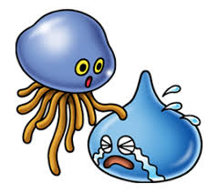

+++
title = "Testing out images"
description = ""
date = "2024-09-27"

[taxonomies] 
tags = ["zola", "testing"]
+++

He's such a cutie!

It does make sense that it should be in its own directory since it has files associated with it.  what if i change it to not index.md though?

what if I also do this?

