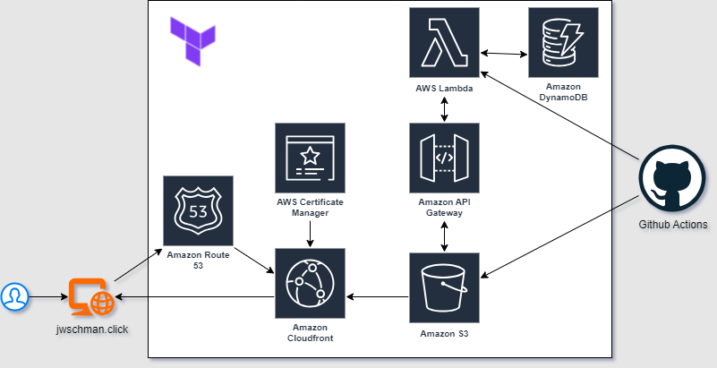
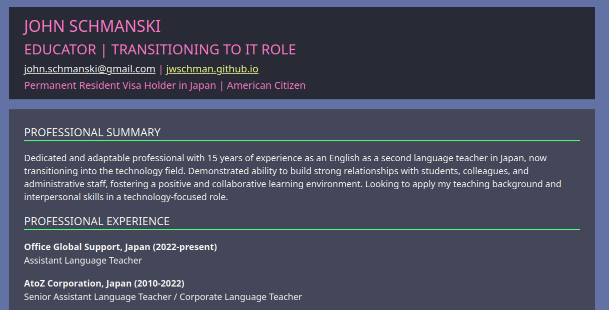
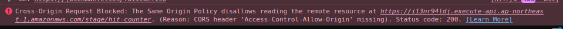

+++
title = "I did the Cloud Resume Challenge"
description = "My three week journey completing the Cloud Resume Challenge"
date = "2025-07-16"

[taxonomies] 
tags = ["cloud resume challenge", "aws", "terraform", "go"]

[extra]
cover_image="cover-image.png"
+++

> ***TLDR***: I completed the [Cloud Resume Challenge](https://cloudresumechallenge.dev/).  [Check out my live site here](https://jwschman.click) or [explore the github repo for all the resources here](https://github.com/jwschman/cloud-resume-challenge).

Last month while looking for jobs I stumbled upon the [Cloud Resume Challenge](https://cloudresumechallenge.dev/) and thought that it was perfect for me.  The idea of building something concrete to showcase my skills while working with the technologies I've been actively learning was exactly what I needed.  So I gave it a shot and three weeks later here we are.

## What It Is

The Cloud Resume Challenge is a number of steps and requirements with the end goal of building a static website hosting your resume.  

The challenge asks you to:

- Host a static HTML/CSS resume with AWS S3 and Cloudfront
- Build a hit counter with a lambda function and DynamoDB
- Tie everything together with an API gateway and JavaScript
- Implement a CI/CD pipeline for all of these resources
- Write a blog post about the process

It doesn't tell you how to do any of these steps, but instead is more of a set of guiderails to get you to the final goal.  

## How I Completed It

I decided to go with the suggested "chunks" in the book which provides a little bit of structure by grouping some of the steps together.  I also decided to go with the AWS version as I already had the AWS Cloud Practitioner Certificate.  I completed all of the chunks in about 20 hours spread over three weeks aside from the final chunk, which is writing this blog post.

I also set up a couple ground rules when I started.  I wanted this work to be all my own, and I also wanted to actually both learn new things and apply my knowledge as I went.

These are the rules that I set up:

- Zero GenAI:  If I had a question or wanted suggestions, I had to search for it rather than just ask for the answer.  I know that using GenAI would have made several portions of this challenge simpler and quicker, and it is also certainly used by people actually working with these technologies professionally, but I wanted hands on experience doing it the hard way first.
- No Full Guides:  I actually didn't check, but I assume there are full guides for prebuilt Cloud Resume Challenge projects.  That seems like it would completely defeat the purpose of this challenge.  Specific guides such as "How to setup cloudfront in Terraform" are OK, but "Full Cloud Resume Challenge" guides aren't.

## Making the Challenge My Own

Because the challenge is a set of goals rather than a guide, it encourages you to modify it to your needs.  Here are some of the things I did a little bit differently than the guide suggested:

- Terraform Everything:  From the first step I took I wanted everything I did to be done with IaC, and I have also been learning Terraform lately so the timing worked out perfectly.  This definitely upped the difficulty because I couldn't just go into the AWS Management Console and click my way to what I wanted, but it gave me real experience with IaC and specifically Terraform.
- Golang instead of Python:  Since I began seriously pursuing tech as a career last year, one of my focuses has been getting comfortable with Golang so I saw this as another chance to use it.  The challenge asks you to make a Python script for your lambda function but I decided to write it in Go instead.

## Final Product

The actual site is at [jwschman.click](https://jwschman.click).  And here's a cool little diagram I made on [draw.io](https://draw.io) that shows most of the services I used for the project and how they're connected.



If you're interested in learning about how I completed the challenge, I'll explain it chunk by chunk next.

## Chunk 1: Frontend

I've enjoyed building little html websites since high school so this chunk was fun.  I did have to do various searches for "css a attributes" or "centering text in div" or whatever, but I wound up with something that I think looks simple but also pretty good.  Recently I've really liked the [Dracula Theme](https://draculatheme.com) so I went with that for my colors.



Setting up the actual infrastructure on AWS was a little more difficult, specifically the cloudfront distribution and DNS, but I managed to get them working with terraform without too much trouble.  Permissions were probably the hardest point here because a guide had used `PrincipalArn` not `SourceArn` in the IAM policy for the bucket, but once I got that sorted out things worked perfectly and I was feeling pretty good.

### Time Spent on this Chunk: 8 hours

### Resources Used

- <https://codepen.io/emzarts/pen/OXzmym>
- <http://lospec.com/palette-list/dracula-standard>
- <https://denisgulev.com/static-website-with-aws-s3-cloudfront-and-terraform/>
- <https://registry.terraform.io/providers/hashicorp/aws/latest/docs/resources/cloudfront_distribution>
- [Terraform AWS Provider Documentation](https://registry.terraform.io/providers/hashicorp/aws/latest/docs)

## Chunk 2: API

This is where I made my big departure from the original directions and went with Golang rather than Python.  There are a lot of resources that I found for writing Golang functions that could communicate with AWS resources, but it seems to be a pretty complicated process that isn't super beginner friendly.  After a bit of trial and error I had a working Lambda function, deployed with Terraform, communicating with a DynamoDB database.

"Communicating" was a little bit of a hard part, not because I didn't understand how to get it to work, but because of something that should have been obvious.  I spent an hour debugging what I thought were complex IAM permission issues.  I checked policies and recreated resources.  The actual problem?  A typo: `dynamodb:GetItme` instead of `dynamodb:GetItem` in my Terraform file.  Oops... a humbling mistake.

### Time Spent on this Chunk: 6 hours

### Resources Used

- <https://www.thedevbook.com/deploy-go-aws-lambda-function-using-terraform/>
- <https://hevodata.com/learn/lambda-dynamodb/>
- <https://medium.com/@jamesscarr6/how-to-deploy-an-aws-go-lambda-function-via-terraform-in-under-5-mins-2025-be9d9b2decfa>
- <https://www.geeksforgeeks.org/devops/create-aws-api-gateway-with-terraform/>

## Chunk 3: Front-end / Back-end Integration

At first this chunk seemed pretty easy.  I don't know any JavaScript but doing a simple API call didn't seem like it would be hard, and it wasn't.  Getting that API call to work in a web browser, however, was more than I expected.  I had never even heard of CORS until I saw the error message in the console of Firefox.



CORS took me by surprise, but I found a couple guides online that helped me through fixing it, and once I understood what I needed to implement it actually wasn't so bad.

Mostly I just needed to change the way I handled the Lambda function and add some return headers for it.

```go
return events.APIGatewayProxyResponse{
    StatusCode: 200,
    Headers: map[string]string{
        "Content-Type":                 "application/json",
        "Access-Control-Allow-Origin":  "*",                          // FOR CORS
        "Access-Control-Allow-Methods": "POST,OPTIONS",               // FOR CORS
        "Access-Control-Allow-Headers": "Content-Type,Authorization", // FOR CORS
    },
    Body: string(responseBody),
}, nil
```

As for testing, I just did a couple simple tests using Cypress Tests as recommended by the Cloud Challenge Guidebook.  Because the hit counter function is so small I didn't want to take a lot of time finding and writing tests for it, so I kept this part extremely simple.  I know there was a lot more I could have done here but I decided to move on from this after just a little bit of work.

### Time Spent on this Chunk: 3 hours

### Resources Used

- <https://www.reddit.com/r/javascript/comments/5blh60/displaying_json_content_in_html/>
- <https://basescripts.com/how-to-fetch-and-display-api-data-on-your-website>
- <https://itsyndicate.org/blog/configuring-cors-and-integration-on-aws-api-gateway-using-terraform/>

## Chunk 4: Automation / CI

This was probably the easiest chunk for me to do since I had built everything in Terraform from the start.  The biggest part of this step was reorganizing everything I had set up into modules, and cleaning up unused and redundant variables and locals.  I'm sure things could be cleaner, but it all works and is fairly clean.

This is also the chunk where I decided to switch to a remote state for Terraform which I also set up on AWS using a separate terraform root.  Nothing fancy, but it cleaned things up and helped with the automation.

So now whenever I push changes to either the frontend website or lambda function in my github repo, those changes are automatically applied to the AWS resources through github actions.  I could also have it apply if I were to make any changes to the main Terraform resources, but at the moment I think it's best to keep it isolated to those things, and manage the rest of the resources locally.  Because of the remote state both GitHub and my local machine can manage it, which is exactly what I wanted.

### Time Spent on this Chunk: 3 hours (mostly cleanup)

### Resources Used

- Just some Google searches for doing Terraform apply as github actions

## Chunk 5: The Blog, Final Thoughts, and Reflection

### Total Time Spent: 20 hours over about 3 weeks

Here I am now writing the blog post about how I felt the challenge went and my experience during it.  Overall the difficulty level was about what I expected.  Some parts such as setting up the actual AWS infrastructure in Terraform were quite straightforward, and some parts such as writing the Lambda function in Go and dealing with CORS took me by surprise.

### What I'd do Differently

If I wanted to spend more time on this project I would have done several of the additional mods, specifically the DevOps and security focused modules.  I would have also spent more time at the start planning the structure of the Terraform modules, but I think that may just be something that comes with experience.  I also wish I had taken some more screenshots of problems and errors that I could have used for this post, like the permission errors for my Lambda function.

### The Real Value

This challenge really gave me a chance to tie together a lot of the things that I've learned in the last year.  Instead of just having isolated knowledge of cloud basics and terraform syntax I now know how they can be used together in a real system.  And even better, I have something concrete to show to potential employers with both the public website and the GitHub repo for it.

### If You're Considering It

If you're interested in doing the Cloud Resume Challenge yourself, I definitely recommend it.  There's a learning curve, but that's the point.  It gives you a structured framework and lets you find the resources necessary to do it.  Also it's satisfying being able to see your website and know that you built every part of it.

Check it out at [The Cloud Resume Challenge](https://cloudresumechallenge.dev/).
