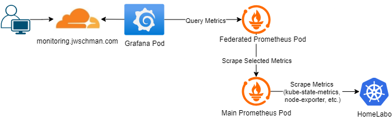

+++
title = "Now Live: Homelab Public Metrics"
description = "Exposing a public Grafana dashboard for my homelab using Prometheus, ArgoCD, and Cloudflare"
date = "2025-10-07"

[taxonomies] 
tags = ["homelab", "monitoring", "prometheus", "grafana"]

[extra]
cover_image="cover-image.png"
+++

> **TL;DR**: I made a public metrics dashboard for my Kubernetes homelab.  You can find it [here](https://monitoring.jwschman.com).

In order to provide a small window into the status of my homelab, I decided to make a public Grafana dashboard with a few key metrics available.  Here's how I made it available.

## What I wanted

Like with most of my projects I wanted this one to be as simple as possible.  I just wanted a public dashboard available that could be reached at <https://monitoring.jwschman.com>.  I also wanted to keep the number of metrics low but also informative.  I specifically wanted node status, number of pods, and a couple of node system metrics.  I may add a few at a later date, but for now I like what I went with.

## Provisioning and GitOps

I wanted the Grafana instance for the public dashboard to run statelessly, without persistent storage, so I can tear it down and rebuild it at any time without losing the dashboard.  To achieve this, I provisioned the dashboard through a ConfigMap containing its JSON definition, and let ArgoCD apply any updates automatically.  This GitOps approach means the entire dashboard configuration lives in my git repository and any changes are automatically synchronized with the cluster.

## Diagram

## Security concerns

Obviously with making something like this public there are a lot of things to worry about.  A Grafana Cloud dashboard would have been the easy solution to these, but with the free account I wouldn't have been able to have it hosted at the site I wanted.  It also kind of goes against the "self-hosted" nature of what I wanted to do.

Sensitive data being exposed was a concern I wanted to address.  To mitigate this I went with a federated instance of Prometheus that only scraped certain metrics.  That way if someone was able to make arbitrary queries through the Grafana dashboard, they'll only have access to a predefined small set of metrics with no sensitive data included.

Also, a DDoS attack is unlikely, but possible.  Fortunately this is handled at the Cloudflare level, which provides basic filtering and mitigation before traffic ever reaches my cluster.

As for the Grafana instance itself, I disabled the admin user as well as signup and login.  I also set a default home dashboard to be automatically displayed, and configured my NGINX ingress to redirect all traffic to the default dashboard in kiosk mode.

## Future plans

There are a few things I'd like to add to this setup in the future.

### Power consumption panel

I'd like to add a panel for total power consumption by the entire cluster.  I'll be able to do this using my [Simple Shelly Exporter](https://github.com/jwschman/simple-shelly-exporter), but at the moment I don't have an unused Shelly Plug to use for this.

### Fewer federated metrics

I want the federated Prometheus to scrape as few metrics as possible.  One way to reduce this further is by using recording rules for aggregated metrics.  For example, instead of exposing memory and CPU limits for every pod, I could create pre-aggregated metrics and federate just those, reducing dozens of metrics to a single one.

### Custom branding

While Grafana's default branding works fine, I'd eventually like to customize it.  Specifically a little custom branding and page title.  I found that this can be done by building a custom Grafana image and running that.  It doesn't seem like much work, but it's more than I wanted to do before publishing this.

## Public config

All of the configurations for this setup are available inside my [HomeLabo github repo here](https://github.com/jwschman/homelabo/tree/main/apps/external-monitoring).
