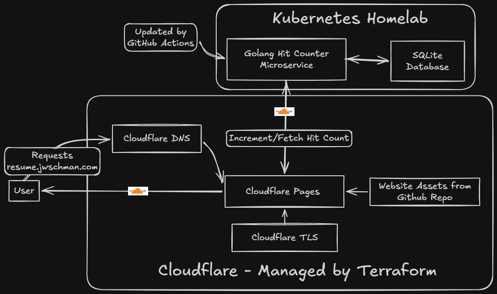

+++
title = "De-AWSing My Cloud Resume Challenge"
description = "Saving two bucks a month by self-hosting part of my Cloud Resume Challenge"
date = "2026-03-04"

[taxonomies] 
tags = ["cloud resume challenge", "kubernetes", "terraform", "go", "cloudflare"]

[extra]
cover_image="cover-image.png"
+++

>TLDR: I rebuilt my Cloud Resume Challenge using cloudflare and a self hosted backend.  You can check it out at [resume.jwschman.com](https://resume.jwschman.com)

Last summer [I did the Cloud Resume Challenge](https://jwschman.github.io/posts/2025/07-16-completing-the-cloud-resume-challenge/).  It was a great experience and gave me some real-world experience building cloud infrastructure and managing all of it with infrastructure-as-code.  If you're interested, I suggest giving that writeup a read.  But, it didn't get the kind of traction that I wanted.  My personal goal for the challenge was to give potential employers something concrete to look at.  But... my job search continues 8 months later, so take that how you will.

Most of the services I was using from AWS were covered under the free tier, but not all of them.  Every month my bill for the site was coming to about ¥250.  Not a lot, but not nothing.  It also didn't help that the site just sits completely unseen by anyone, and I felt like I was just throwing that money of away.  I didn't want to take the site down, but I didn't want to keep paying for it either.

## My Solution

I decided to deAWS the whole thing.  Self-host what I could, use free resources where available, and still keep as much of it set in IaC as possible.  The whole thing just took a couple hours over the weekend since I already knew everything that I would need.

## The Pieces

### Website

The website is hosted on Cloudflare Pages.  The domain name and DNS I'm using are already from Cloudflare so it made sense to try it out.  This picks up the static site any time I push it to my GitHub repo and automatically deploys it.  It's very similar to the S3 static site hosting, but honestly a little cooler because of the GitHub integration.

The website is still the same website I used before, only updated with current information, and the javascript edited to call my new backend.

### My New Backend

This is the part that I wanted to do the most, even when I was doing the original challenge.  I decided to containerize what was the Lambda hit-counter function and run it in my homelab Kubernetes cluster.  I have this available, and I like self hosting things, so it made sense to run things here.

I did have to make several changes to how the hit counter worked, but it's doing the exact same thing as before.  Since I'd already written the original Lambda function in Go, building the new backend was straightforward.  I set up a Gin server to receive a POST request from the website, update a database, and return the new hit count.

I wouldn't have access to any managed databases for this, and running another instance of PostgreSQL for just a single row seemed like overkill, so I decided to go with SQLite for this application.  It was my first time actually using SQLite in my own app and was surprisingly simple.

Since I'm calling this a migration I didn't want my hits to be reset to 0, so I just initially set them to the very impressive value of 250 which is what it was on the original site.  I'm pretty sure more than half of those views were me.

I use external-dns to automatically create DNS records on Cloudflare for services inside my cluster so I didn't need to specify one in my Terraform, which brings me to:

### Infrastructure-as-code

Because of the way I'm doing things now, I wasn't able to set everything up in Terraform like I could before.  For one, a couple Cloudflare things needed to be initialized (the API token and cloudflare pages) on the website before I could use them inside Terraform.  The remote state bucket also needed to be prepared.  I could have gone with Terraform's own offerings, but I wanted to stick with Cloudflare here since I'm already using it for everything else.  Once I had those set up I was able to manage pretty much everything with Terraform aside from the container, which lives in my homelab.  That's managed by ArgoCD though, so I guess it's still IaC.

### GitOps

I like GitOps, and two of the big parts of this project are handled that way.  Cloudflare Pages picks up changes to the website as I push them to GitHub, and any changes made to the hit-counter will trigger a container build that will automatically get pushed to Dockerhub.

The only thing I'm currently not doing with GitOps is the actual `terraform plan` and `terraform apply`.  This is because of how I handle credentials.  I'm using a remote state on Cloudflare which needs my credentials, and isn't as elegant as the AWS offering.  I could put all the secrets inside my GitHub secrets, but for such a simple project it seemed unnecessary.  I mean, once I run my initial `terraform apply` I shouldn't have to touch any of this infrastructure again.  Changes to the backend and website are already covered.

## Why not self-host the website also?

It wouldn't have been an issue to also run an instance of NGINX inside my homelab and host the site there, but I wanted to try out the Cloudflare Pages integration and found it to work great.  I know I mentioned that I like self-hosting things, but knowing when to delegate ownership is also important.

## Final Product

The new site is available at [resume.jwschman.com](https://resume.jwschman.com).  And again, here's a cool diagram I made with [Excalidraw Whiteboard](https://excalidraw.com/) this time to show how the services are connected.

[You can also check out the GitHub repo here](https://github.com/jwschman/zero-cost-cloud-resume-challenge).

## Final Thoughts

I'm glad that I was able to save myself about ¥250 a month, but I'm even more glad that I'm self hosting my backend now.  It's what I originally wanted to do with the challenge, and I think it's cooler to have this split setup of Cloudflare Pages hitting my homelab.

I'm also glad that I decided to set up everything in Terraform from the beginning, so when I wanted to take down the old project all I had to do was `terraform destroy` and be done with it.

Also, now I've done the Cloud Resume Challenge basically twice, so I can include it twice on my resume... right?

## Bonus Tip

Just so you know... naming the script hit-counter.js will definitely get blocked by uBlock origin, so maybe come up with a different name if you're taking the challenge.  I went with "stats" this time around.
