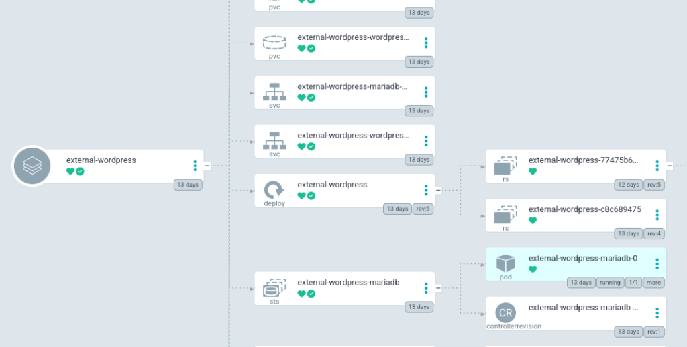
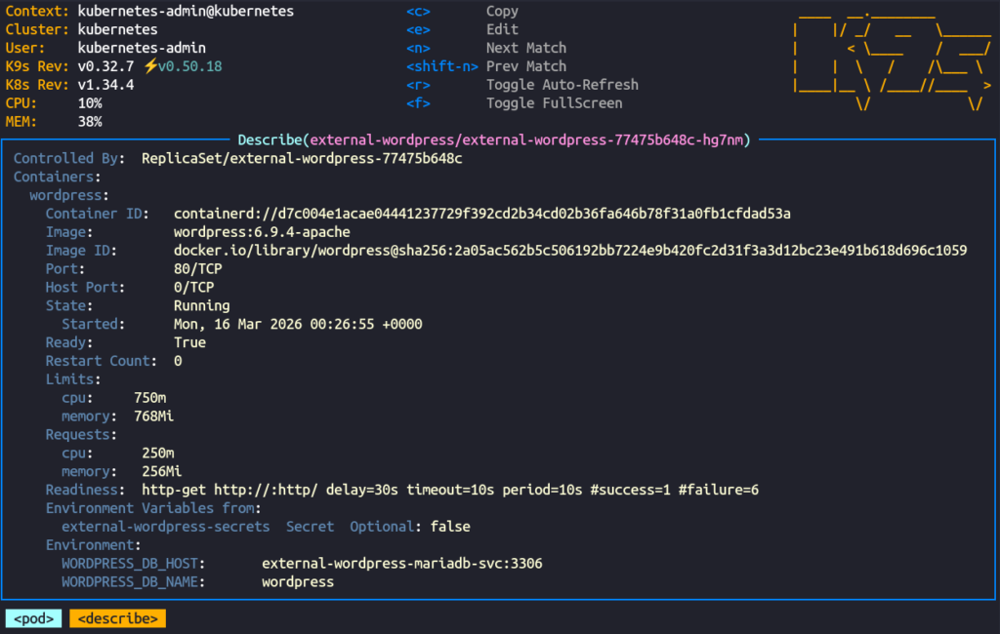

+++
title = "Production-Grade WordPress on Kubernetes: Doing it Correctly"
description = "I deployed a public facing Wordpress portfolio site."
date = "2026-03-25"

[taxonomies] 
tags = ["kubernetes", "wordpress", "homelab", "portfolio", "self-hosting"]

[extra]
cover_image="hero.png"
+++

I've run WordPress internally for years as a personal journal.  It's just a way for me to keep track of my thoughts and look back at the things I've done throughout the years.  I like to document things like homelab hardware upgrades, my favorite TV shows of the year, and personal projects that don't deserve a full write-up on my actual blog.  I find it's more structured than just using a note-taking app for this use.

I also often see neglected WordPress instances in the wild, but I've never tried to run a public production ready WordPress.  The reputation is that they're hard to manage and riddled with vulnerabilities.  I actually had a friend sort of sneer when he found that I run that private one in my own network, saying that hosting that was a security nightmare.  And honestly, the reputation is a little bit deserved, but it doesn't have to be.

So I decided to actually give setting up a self-hosted Production-grade hardened WordPress instance a shot.  There are a number of security concerns that I'll cover throughout this post.  Also, there is an endless supply of managed WordPress solutions, but I'll make the case for self-hosting over managed solutions, and why running it on Kubernetes is a great way to do it properly.

## Why Self-Hosted?

Managed WordPress hosting is everywhere.  Sites like WP Engine, Kinsta, WordPress.com and many, many others are convenient, but you're trading control for simplicity.  You don't own the infrastructure, you can't audit the security configuration, and you're locked into their backup and migration tools.  This also means that if the site makes a major change, you're stuck with it whether you wanted it or not.  Running it yourself means you own the entire stack, you know exactly what's running and why, and the deployment is documented and repeatable, and for a portfolio piece that's the whole point.

## The Stack

There's actually quite a bit of infrastructure behind this deployment:

- Kubernetes - bare-metal homelab cluster
- MariaDB - database backend, deployed as a StatefulSet
- Longhorn - persistent storage with replicas for data redundancy
- ArgoCD - GitOps deployment with all manifests in my public GitHub repo
- Vault + External Secrets Operator - secrets management which lets me keep my credentials out of Git
- cert-manager + Let's Encrypt - automated TLS
- Cloudflare - DNS, CDN, and primary WAF layer

## The Actual Deployment

The full manifests are available in [the GitHub repo](https://github.com/jwschman/homelabo/tree/main/apps/external-wordpress), but the deployment consists of:

- A Deployment for WordPress with a Recreate strategy, resource limits, readiness and liveness probes, and the wp-content directory mounted from a PVC
- A StatefulSet for MariaDB with its data directory on a separate PVC
- ExternalSecret resources pulling credentials from Vault for both WordPress and MariaDB
- A ConfigMap for wp-config extras: site URL and any configuration that needs to survive pod restarts
- Services for internal cluster communication between WordPress and MariaDB
- A HTTPRoute for external access using my Traefik gateway
- A Longhorn Volume + PV + PVC for each persistent data directory

## Secrets Management

I've made the manifests for this deployment public as part of my Homelab project, which means anyone can see how the deployment is structured, so secrets management is very important.  Fortunately I already have a system set up that I use for everything else, so I just used my normal workflow here.

Inside Hashicorp Vault I created secrets for my MariaDB and WordPress passwords, and I use External Secrets Operator to create ExternalSecret resources inside my Kubernetes cluster.  This pulls in the secrets from Vault that I can just mount inside my pods as environment variables.

## Hardening

Aside from just keeping WordPress and any plugins updated, there are also a few other precautions I took.

The primary firewall for the site is handled by Cloudflare.  DNS is handled through Cloudflare, and connections to my server are sent through their proxy.  I have custom WAF rules blocking `xmlrpc.php`, which is a legacy WordPress endpoint that can be abused for brute force attacks and DDoS amplification.  I also block `readme.html` and `license.txt`, which expose your WordPress version and give attackers a free starting point for targeting known vulnerabilities.

As a second measure, I also used a plugin called Wordfence to protect my site.  It also provides a WAF, brute force protection, version hiding, and uploads directory protection.  It's possibly unnecessary with Cloudflare already being in front of everything, but it does provide an extra layer of security.

I also use another plugin called WPS Hide Login which does exactly what its name says.  I can just change the path for the login page to whatever I want to hide it from potential hackers crawling the internet for insecure WordPress login pages.  I was previously using the `/wp-login.php` page for my readiness probes in Kubernetes, but after switching to the hidden page, I just changed the probes to hit `/` which should also be available when WordPress is ready.

I intentionally kept a small plugin footprint here.  First, other plugins are unnecessary for my use case on this site, but superfluous plugins just increase complexity and attack surface.

## Backups

For a proper production-ready deployment we'll need backups.  I already have data redundancy with Longhorn, which is backed up nightly to my TrueNAS server.

But I also wanted to try a native WordPress solution, and I decided to go with UpdraftPlus.  One of the cool things about UpdraftPlus is that it's also a migration tool, so if I ever wanted to take my data to a different provider I could just use what I already have.  Most of their fancy services are behind a paywall, but everything I needed here was in the free tier.

UpdraftPlus offers a number of backup targets, s3 being the most tempting choice for a production server.  Unfortunately the s3 endpoint I use for backups is not available on outside networks, so I decided to go simple here and linked my Dropbox account.  The first manual backup completed successfully and landed in Dropbox within minutes.  It works great, the backups don't take much space, and I can be sure the data is secure.  I could even set retention policies so that I didn't keep an unnecessary amount of backups.  In my situation I just went with weekly backups with only two retained.

## Things That Are Different on Kubernetes/Docker

One thing worth noting is that Wordfence's WAF optimization, which uses auto_prepend_file to load the firewall before any other PHP, doesn't persist in a containerized environment.  The optimization writes to `.htaccess` or `php.ini` in the container filesystem, which is ephemeral and lost on every pod restart.  I skipped the optimization entirely, which means Wordfence runs in basic mode.  This is fine for my use case because Cloudflare is the real perimeter defense and Wordfence is just an additional layer for scanning and brute force protection.

Plugin config lives in the database, not Git, which goes against my Infrastructure-As-Code ethos, but that's more a WordPress thing than a Kubernetes thing.  Fortunately UpdraftPlus captures it and makes restoration of my configuration simple.

The actual container filesystem is ephemeral and wp-content lives on a PVC.  Everything else rebuilds from the image whenever the pod restarts.  This makes keeping the pod up to date very simple, I just bump the version number in my Deployment manifest, and ArgoCD brings up the new version.

If you look closely at my actual Deployment, you'll notice that I went with Recreate rather than RollingUpdate for the recreation strategy.  I do this because my Longhorn volumes are ReadWriteOnce, meaning they can only be mounted by a single node at a time, and scheduling the new pod on a different node would cause issues with Longhorn mounting it.  Other storage solutions wouldn't have this issue.

## Lessons Learned / Gotchas

The first was discovering that add_filter() can't run inside `wp-config.php`.  I initially tried to disable XML-RPC there via a filter hook, but WordPress hasn't loaded its plugin functions yet at that point in the bootstrap process, and it failed with a fatal error.  The fix was to handle XML-RPC blocking at the Cloudflare WAF level instead as I mentioned previously, which is actually the better solution anyway.

The second was WPS Hide Login breaking my readiness probe. My probe was hitting `/wp-login.php` to check if WordPress was ready, and the moment I changed the login URL the probe started failing and Kubernetes began restarting the pod.  The fix was just pointing the probe at `/` instead, but it's the kind of thing that can catch you off guard if you're not thinking about it.

Memory limits also bit me. I had set fairly conservative limits that worked fine for normal traffic.  But the WordPress admin panel, especially the theme customizer, is quite resource intensive, and the pod kept getting killed mid-session until I bumped the memory limit up.

Finally, Cloudflare's caching made it difficult to verify changes during development.  I'd update something, reload the page, and see the old cached version.  You could work around this by temporarily setting Cloudflare's caching level to bypass or purging the cache manually after each change, but I took a different approach.  I kept the site on my internal gateway during development so it was only accessible on my local network, bypassing Cloudflare entirely.  Once the site was ready, I switched to the external gateway to make it publicly available through Cloudflare.  This gave me a clean separation between development and production, and no cache headaches.

## Conclusion

This was a genuinely fun project.  It gave me a chance to work with a technology I'd only ever run privately, apply my normal infrastructure workflow to it, and end up with something that's actually publicly useful as a portfolio piece.

It also reminded me very quickly that I am not a designer.  Fortunately WordPress's theming took care of most of the heavy lifting, but I did spend an embarrassing amount of time on a few of the sections.

If you've made it this far and are looking for someone to handle your infrastructure, Kubernetes deployments, or maybe even WordPress administration, feel free to reach out.  My contact info is all over the site.

And now I get to deal with that friend being even more judgemental that I have a publicly accessible WordPress running on my private infrastructure.
