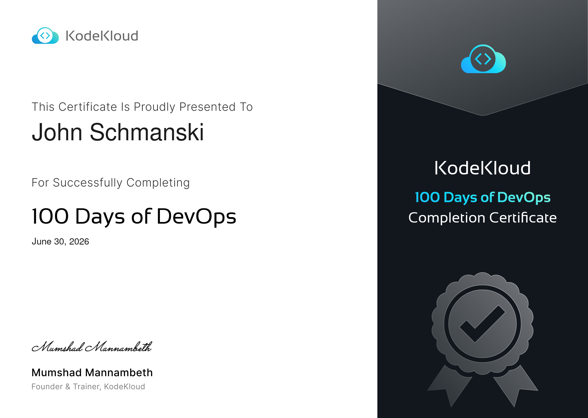

+++
title = "Completing 100 Days of DevOps"
description = "A section-by-section look back at KodeKloud's 100 Days of DevOps"
date = "2026-06-30"

[taxonomies] 
tags = ["kodekloud", "kubernetes", "terraform", "aws", "devops"]

[extra]
cover_image="cover-image.png"
+++

About two months ago I started [KodeKloud's 100 Days of DevOps](https://kodekloud.com/100-days-of-devops) and I've finally completed it, so I figured it's time for a brief writeup with my thoughts about it.

The course (Challenge?  Task?  I don't really know what to call it...) consisted of several different sections for different types of DevOps tasks.  Everything in it was an actual task to complete, not just questions to be answered.  Some of them were quite simple, while others were multi-step tasks that took a good bit of time.  I think they're all designed to be real-world tasks a DevOps engineer may be asked to do during a workday.

The realism extended to the wording of some of the tasks as well.  Some tasks are a little vague, awkwardly phrased, or missing information.  I imagine this was done to mimic getting poorly communicated tasks while working in a real DevOps position.

## My Workflow

I did all of these tasks in the evening after everything had settled down for the day, and I'd only spend about an hour each night doing them.  This meant that I'd often be able to do several tasks in a single night.

I kept track of the tasks and my solutions as well as brief insights in [my GitHub repo](https://github.com/jwschman/100-days-of-devops).  Check it out if you'd like to see the actual tasks and also how I chose to approach them.

I always wrote my plan, commands, and configs first in VSCode which also served as a way for me to document my solutions.  Then I'd write how to verify the solutions and my insights.  Often it took longer to do the writing than to actually complete the task.  I'd always do this while looking through the documentation for whatever section the task was.

## The Sections

### Linux Administration

It was funny that the very first task (creating a user with a non-interactive shell) was a question I got wrong when I took the LFCS back in 2024.  Oh well, I know how to do it now.  Everything here was fairly simple: creating users, setting permissions, installing and enabling services, and basic networking.  The iptables task was a nice refresher since I hadn't touched it since the LFCS.

### Git

This section taught me commands I didn't even know existed, like `cherry-pick`, and gave me real practice with `rebase`, `stash`, resolving `merge` conflicts, and setting up a `post-update` hook, which are all things I never really had a need for working alone.  One task had me do a `git reset --hard` followed by a `git push -f` which would be a little scary in a real-world situation since you're rewriting history.

Git is like... really important and I should probably learn it more in-depth.

### Docker

If someone had no experience with Docker before this, I imagine they'd have a lot of troubles with it.  Fortunately, I use docker all the time so I found this section to be a breeze.  There were tasks such as pulling and building images, and writing docker compose files.

I did have a little trouble at one point when I had to run commands inside a stripped down container and couldn't use `vi` so I made my edits with `sed` instead, but it's a good reminder that a container isn't a full OS.

### Kubernetes

This was by far my favorite part of the course (shocking I know!).  If you've read some of my other posts, you know that I really like working with Kubernetes so this was a fun section.  Now that my cluster is pretty much set up and running how I want, I don't get much time to poke around in it and mess with stuff, which is what I actually like to do.  This section let me do that with its tasks.

This section had the most variety, covering pods, deployments, volumes, init containers, sidecars, secrets, ConfigMaps... things I use all the time.  I especially liked tasks where I was given a broken deployment and had to track down what went wrong, which is exactly the kind of thing I like doing, but I'm not going to break something on purpose in my own cluster...

It reminded me of when I took the CKA.   The tips I learned for that test worked well here, such as doing something like `kubectl run pod-httpd --image=httpd:latest --dry-run=client -oyaml > pod.yaml` to get a pod template to work with, and then building on that.  I hadn't really done anything like that since the test a year ago.

These individual tasks took the most time to complete because there was a lot of work to do with them.

### Jenkins

If Kubernetes was my favorite section, this was my least favorite.  Before coming in to this I had never touched Jenkins in my life.  I had a vague understanding of what it was, but I had never even seen the GUI.

But it was also the section where I learned the most.  Coming in and learning a new (to me) system and workflow through actual tasks was actually quite interesting and something I like to do.

What I didn't like in this section, though, was that it was a lot of repetitive tasks such as the same worker node setup every day.  The actual tasks were simple, but they took time and became a little boring to complete.  There may have been better ways to do the requirements for the tasks, but since I was just looking up documentation and guides while also trying to figure it out myself, things were probably a little bit clunkier than they could have been with someone familiar with Jenkins.

I also didn't particularly like that I was mostly just clicking through the UI to set configurations, specifically because it isn't reproducible and is exactly what I avoid in my own environments.

### Ansible

Here we were back to something I know how to use.  I use Ansible to set up my infrastructure at home, and while I don't do anything super fancy with it, I enjoy using it and it makes things very easy.

Ansible is probably the technology that I most want to learn next.

### Terraform

Another domain that I'm certified in, so this section was also quite fun.  Actually, Terraform and Ansible were the two quickest sections I completed.

Though I'm certified in it, I don't get a ton of chances to work with it since my homelab is all local bare-metal machines, so it was nice to write some HCL again for this.

The tasks were all set in AWS which is where I have the most experience, and involved things like setting up VPCs, IAM, and EC2 instances which are all stuff I did last year for the [Cloud Resume Challenge](https://resume.jwschman.com).

## Tasks vs. the Real World

One thing I kept noticing was the gap between how these tasks do things and how I actually do them in my environments.  For example, the Kubernetes tasks had me run `kubectl edit` and `kubectl create secret`, but in my own cluster I couldn't edit a live resource if I wanted to since ArgoCD would catch the drift and revert it, and my secrets come from Vault through the external secrets operator.  It's genuinely useful to know the manual way, though, and it's exactly what I'd fall back on in an emergency such as ArgoCD itself being the thing that's broken.

## Final Thoughts & What's Next

This challenge gave me exactly what I wanted from it: practical hands-on experience doing actual DevOps tasks.  100 of them.  It took a little bit of time but it was absolutely worth it and I'd recommend it to anyone else who is looking to build real experience rather than just watch videos and follow guides.

The tasks involving Linux, Git, and Kubernetes I was able to breeze through and muscle memory took over.  For other sections I had to keep a documentation window open the whole time to make sure I was doing things correctly.  And honestly I don't really think anybody is writing Ansible playbooks or Terraform resources from memory without those pages open.

I also got this nice little certificate from KodeKloud for completing it:

As for what's next, I have a lot that I'm thinking of.  Above I mentioned wanting to get more comfortable using Ansible and even Git, and in a previous post I talked about pursuing a RHEL certification.  I've also recently become aware of [Linux From Scratch](https://www.linuxfromscratch.org/) and am thinking about giving that a try as a way to deepen my understanding of Linux essentials.  I also just kind of want to play around in the homelab a little more which is where I do my best learning anyway.

But before any of that I think I'm going to take a week or two off and just have a little bit of free time in my evenings.
